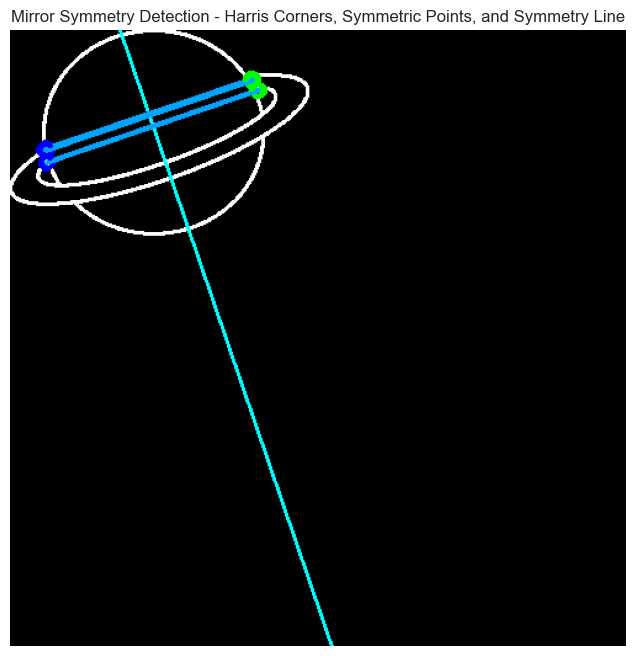
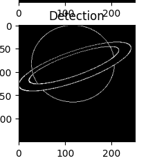
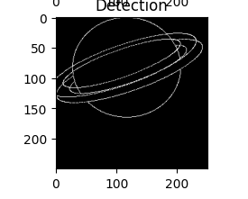

# Symmetry Detection and Analysis Algorithm (Algorithm 1)

This algorithm efficiently identifies and analyzes symmetry in images through a series of methodical steps:

## 1. **Finding the Line of Symmetry**
   - **SIFT Feature Matching:**
     - Utilizes SIFT (Scale-Invariant Feature Transform) to extract keypoints and descriptors from both the original image and its horizontally flipped version.
     - Matches these features using a brute-force matcher (`BFMatcher`), selecting the most accurate matches.
   - **Hexbin Analysis:**
     - Analyzes matched points by calculating the angle and distance (`r`, `theta`) relative to the X-axis.
     - Generates a hexbin plot to visualize the distribution of these `(r, θ)` pairs.
   - **Vote Sorting:**
     - Examines the hexbin plot to identify the most prominent bin, indicating the most likely line of symmetry.

## 2. **Finding and Selecting Harris Corners**
   - **Corner Detection:**
     - Applies Harris corner detection to identify points with significant intensity changes, often corresponding to corners.
   - **Thresholding and Sorting:**
     - Filters detected corners using a threshold and selects the top 15 based on their corner response values (corner strength).
   - **Code Implementation:**
     - The `detect_harris_corners` function processes the image, converting it to grayscale, applying the Harris corner detector, and selecting the top 15 corners.

## 3. **Finding Corresponding Points on the Opposite Side**
   - **Symmetry Line Equation:**
     - Determines the line of symmetry (given by `r` and `theta`), and calculates each detected corner's symmetric counterpart using geometric properties of the line.
   - **Opposite Point Calculation:**
     - Computes the corresponding point for each corner on the opposite side of the symmetry line by reflecting the point across the line.

## 4. **Connecting Points Using B-Spline**
   - **Spline Drawing:**
     - Draws a B-spline curve connecting each original corner and its symmetric counterpart.
     - The `draw_b_spline_curve` function interpolates between these points to create smooth connecting curves.

## Final Display
   - The final image displays the original Harris corners, their symmetric counterparts, the symmetry line, and the B-spline curves connecting each pair of points.

---

This approach combines feature matching, symmetry detection, corner detection, and curve interpolation to analyze and visualize symmetry in images.

---

# Generalized Hough Transform Algorithm for Shape Detection (Algorithm 2)

This algorithm detects shapes in images using the Generalized Hough Transform. It involves several steps including edge detection, gradient orientation computation, and gradient accumulation.

## Key Components and Steps

### 1. **Edge Detection and Gradient Orientation**
   - **Canny Edge Detection:**
     - Uses the `canny` function to detect edges in the image, effective for identifying boundaries.
   - **Gradient Orientation Calculation:**
     - Computes gradient orientation using the Sobel filter, with gradients calculated in both x and y directions (`dx` and `dy`).

### 2. **R-Table Construction**
   - **Building the R-Table:**
     - Constructs an R-Table based on detected edges and their gradient orientations. It stores relative positions (vectors) of edge points with respect to a reference point.

### 3. **Accumulation of Gradients**
   - **Accumulate Gradients Using R-Table:**
     - Uses the R-Table to accumulate votes in an accumulator array. For each edge point, the function looks up corresponding vectors and increments the accumulator.

### 4. **Overlay and Visualization**
   - **Overlay the Reference Image:**
     - The `overlay_reference_image` function overlays the reference image on the query image at the detected position.
   - **Visualization:**
     - The `test_general_hough` function visualizes the results including the reference image, query image with detected points, the accumulator, and the final overlay.

### 5. **Testing and Usage**
   - **Shape-to-Image Conversion:**
     - Converts a set of shapes into binary images using the `shapes_to_image` function.
   - **Testing:**
     - The `test` function reads shape data from CSV files, converts them to images, and applies the Generalized Hough Transform.

## Example Workflow

1. **Read and Convert Shape Data:**
   - Read shape data from CSV files and convert them to binary images.

2. **Apply Generalized Hough Transform:**
   - Apply the Generalized Hough Transform to the query image using the reference images.

3. **Visualize Results:**
   - Visualize the results including the best match and the overlayed reference image.

## Code Summary

- **Edge Detection:** Uses Canny edge detection and Sobel filter.
- **R-Table Construction:** Creates a lookup table for edge points.
- **Gradient Accumulation:** Accumulates votes in an accumulator array.
- **Overlay and Visualization:** Displays detected shapes and overlays the reference image..

---

# Generalized Hough Transform Algorithm for Shape Detection With Multi-Scale and Multi-Shift Detection (Algorithm 3)

This advanced algorithm detects shapes using the Generalized Hough Transform with added multi-scale and multi-shift detection capabilities.

## Key Components and Steps

### 1. **Edge Detection and Gradient Orientation**
   - **Canny Edge Detection:**
     - Uses the `canny` function to detect edges effectively.
   - **Gradient Orientation Calculation:**
     - Computes gradient orientation using the Sobel filter.

### 2. **R-Table Construction**
   - **Building the R-Table:**
     - Constructs an R-Table based on detected edges and orientations.

### 3. **Accumulation of Gradients**
   - **Accumulate Gradients Using R-Table:**
     - Accumulates votes in an accumulator array.

### 4. **Multi-Scale and Multi-Shift Detection**
   - **Generate Shifts:**
     - Creates a list of possible shifts for the reference image.
   - **Multi-Scale Detection:**
     - Tests different scales of the reference image to detect size variations.
   - **Multi-Shift Detection:**
     - Tests various shifts to find the best alignment.

### 5. **Overlay and Visualization**
   - **Overlay the Reference Image:**
     - Overlays the reference image on the query image at the detected position.
   - **Visualization:**
     - Visualizes the results including the reference image, query image with detected points, and the final overlay.

### 6. **Testing and Usage**
   - **Shape-to-Image Conversion:**
     - Converts shapes to binary images.
   - **Testing:**
     - Reads shape data from CSV files, converts them to images, and applies the Generalized Hough Transform.

## Example Workflow

1. **Read and Convert Shape Data:**
   - Read and convert shape data from CSV files to binary images.

2. **Apply Generalized Hough Transform:**
   - Apply the Generalized Hough Transform with multi-scale and multi-shift detection.

3. **Visualize Results:**
   - Visualize the best match and overlayed reference image.

## Code Summary

- **Edge Detection:** Uses Canny edge detection and Sobel filter.
- **R-Table Construction:** Creates a lookup table for edge points.
- **Gradient Accumulation:** Accumulates votes in an accumulator array.
- **Multi-Scale and Multi-Shift Detection:** Tests different scales and shifts.
- **Overlay and Visualization:** Displays the detected shapes and overlays the reference image.
.

---
